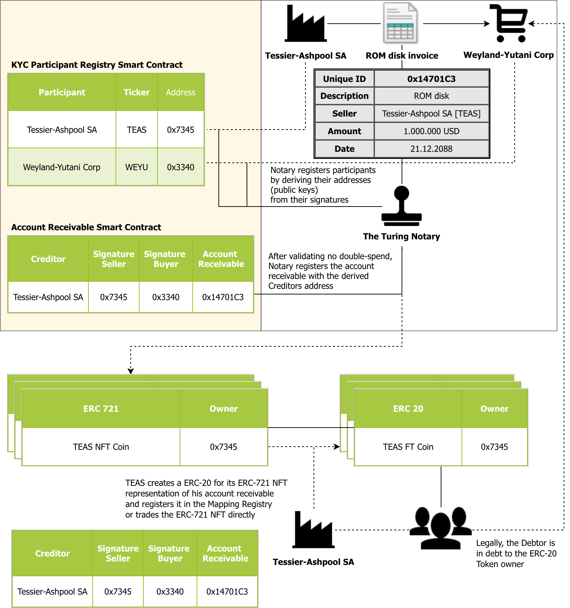

# Receivable Tokenization

This demo includes several steps which are necessary to tokenize an account receivable, ie. an invoice:
 * Buyer signs the invoice with his private keys
 * Seller signs the buyer-signed invoice with his private keys 
 * Document (PDF) and metadata is stored in IPFS, referencing buyer, seller and amount of ERC 20 Tokens
 * ERC 721 with reference (URI) to IPFS-document is created
 * ERC 20 Token which is references by IPFS and indirectly by ERC 721 NFT is created
 
After these steps, the ERC 20 Token represents the invoice, ie. it is the tokenized invoice.  
With the signed IPFS document, embedding the original PDF and the ERC 721 Token as NFT, the origin of the ERC 20 Token can be proven anytime.

# Prerequisites

* Ganache
* Java 8+
* Maven
* optional: Git

# Setup

* Clone project with `git clone` or download the project as a compressed file

# Run

* Start Ganache with mnemonic `candy maple cake sugar pudding cream honey rich smooth crumble sweet treat`
* Build project with `mvn clean package`
* Change to directory target and start application with `java -jar receivable-assets-0.0.1.jar`

# Credentials

## Original EIP712 Signing Demo

This is derived from the demonstration of EIP712 signing support (EIP712 Signing Demo) via MetaMask's `eth_signTypedData_v3` API call.

[Try the original version here.](https://weijiekoh.github.io/eip712-signing-demo/index.html)

You need a version of MetaMask that supports `eth_signTypedData_v3` to use this demo (4.14+).